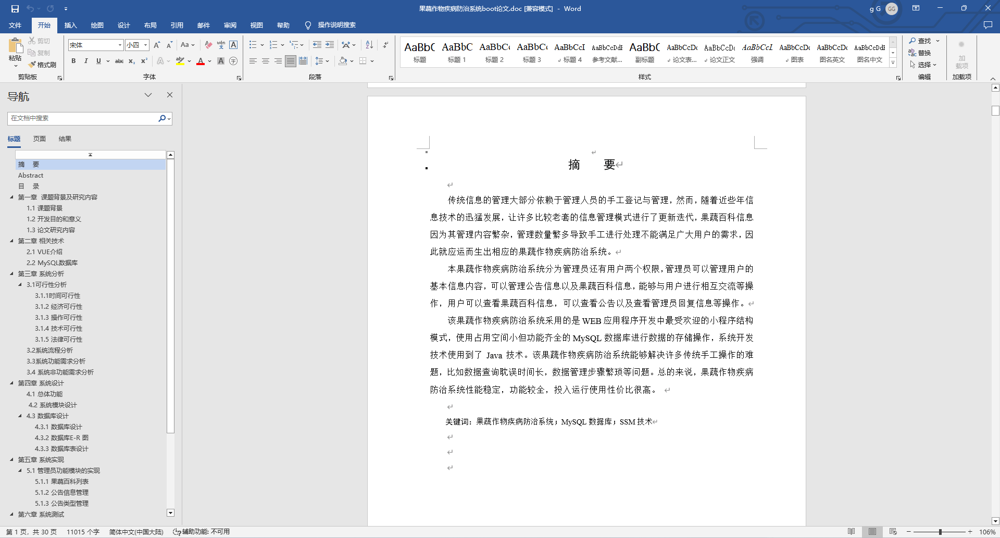
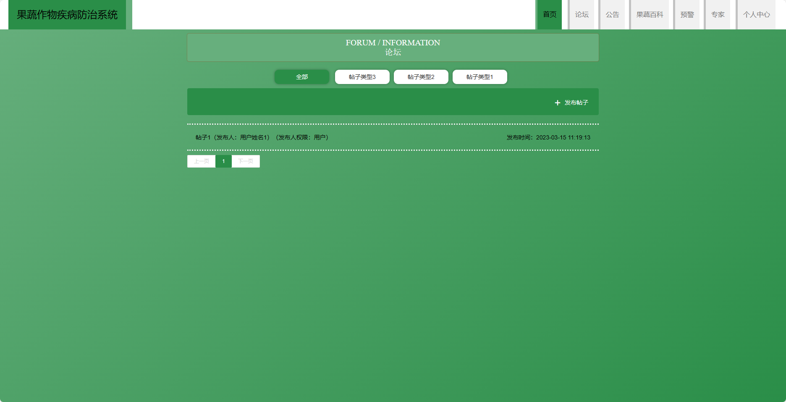
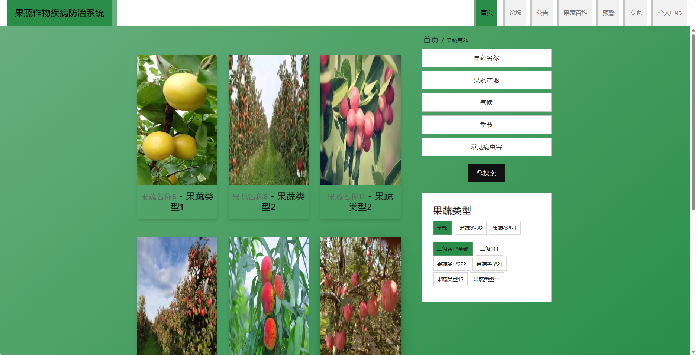
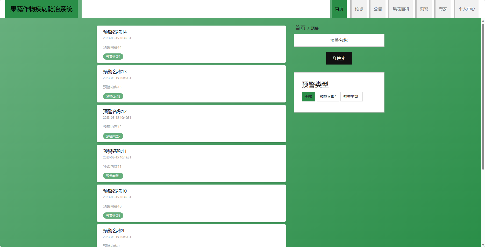
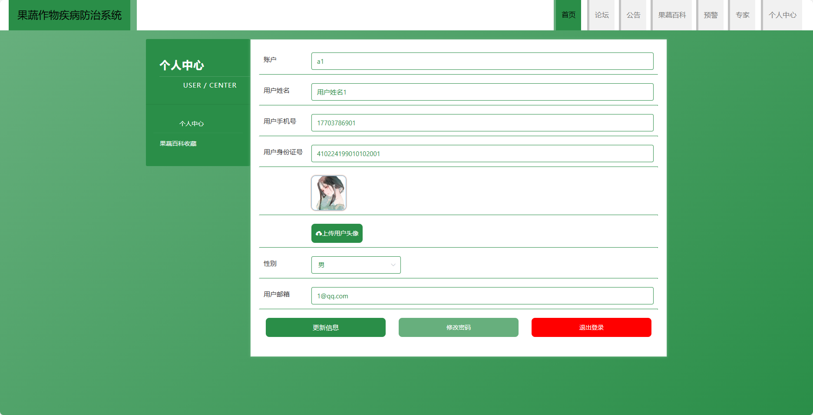
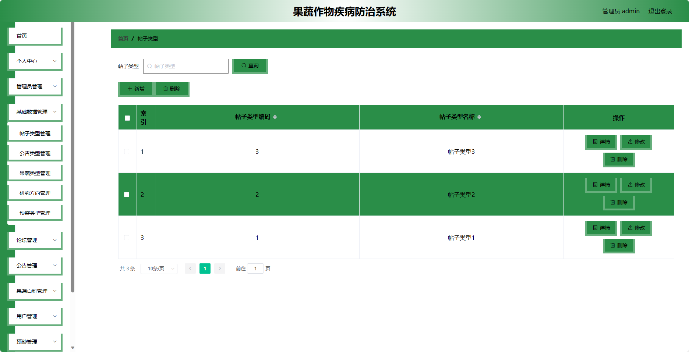

基于Springboot的果蔬作物疾病防治系统（程序+论文）
=
### 完整代码获取地址：从戎源码网 ([https://armycodes.com/](https://armycodes.com/))
### 作者微信：19941326836  QQ：952045282 
### 承接计算机毕业设计、Java毕业设计、Python毕业设计、深度学习、机器学习
### 选题+开题报告+任务书+程序定制+安装调试+论文+答辩ppt 一条龙服务
### 所有选题地址https://github.com/nature924/allProject

一、项目介绍
---
基于Spring Boot框架实现的果蔬作物疾病防治系统，系统包含两种角色：管理员、用户,系统分为前台和后台两大模块，主要功能如下。
### 前台功能模块：
- 首页：展示系统的概览信息、推荐宣讲会等内容。
- 论坛：用户可以在论坛中进行交流、分享经验等。
- 企业：展示注册的企业信息，供用户浏览。
- 公告信息：查看系统发布的公告信息。
- 宣讲会：浏览宣讲会的详细信息，包括时间、地点等。
- 个人中心：用户管理个人信息，包括查看报名宣讲会、修改个人信息等操作。

### 后台管理模块（企业）：
- 个人中心：管理企业的个人信息，包括修改密码等操作。
- 宣讲会管理：发布和管理企业的宣讲会信息，包括添加宣讲会、编辑宣讲会、取消宣讲会等操作。
- 宣讲会报名管理：管理学生对宣讲会的报名情况，包括查看报名学生列表、确认报名等操作。
- 论坛管理：管理企业在论坛的发帖情况，包括查看帖子列表、回复帖子等操作。
- 公告信息管理：发布和管理企业的公告信息。

### 后台管理模块（管理员）：
- 个人中心：管理管理员的个人信息，包括修改密码等操作。
- 管理员管理：管理系统的管理员账号，包括添加管理员、编辑管理员、删除管理员等操作。
- 学生管理：管理学生的个人信息，包括查看学生列表、禁用学生等操作。
- 企业管理：管理企业的个人信息，包括查看企业列表、禁用企业等操作。
- 宣讲会管理：管理所有宣讲会的详细信息，包括查看宣讲会列表、编辑宣讲会、取消宣讲会等操作。
- 宣讲会报名管理：管理学生对宣讲会的报名情况，包括查看报名学生列表、确认报名等操作。
- 就业情况管理：统计和管理学生的就业情况，包括查看就业情况、添加就业情况等操作。
- 基础数据管理：管理系统的基础数据，如学院信息、专业信息等。
- 论坛管理：管理论坛的帖子情况，包括查看帖子列表、回复帖子等操作。
- 公告信息管理：发布和管理系统的公告信息。
- 轮播图信息：管理系统首页的轮播图信息，包括添加轮播图、编辑轮播图、删除轮播图等操作。

二、项目技术
---
- 编程语言：Java
- 数据库：MySQL
- 项目管理工具：Maven
- 前端技术：VUE、HTML、Jquery、Bootstrap
- 后端技术：Spring、SpringMVC、MyBatis

三、运行环境
---
- 操作系统：Windows、macOS都可以
- JDK版本：JDK1.8以上都可以
- 开发工具：IDEA、Ecplise、Myecplise都可以
- 数据库: MySQL5.7以上都可以
- Tomcat：任意版本都可以
- Maven：任意版本都可以

四、运行截图
---
### 论文截图：

### 程序截图：

